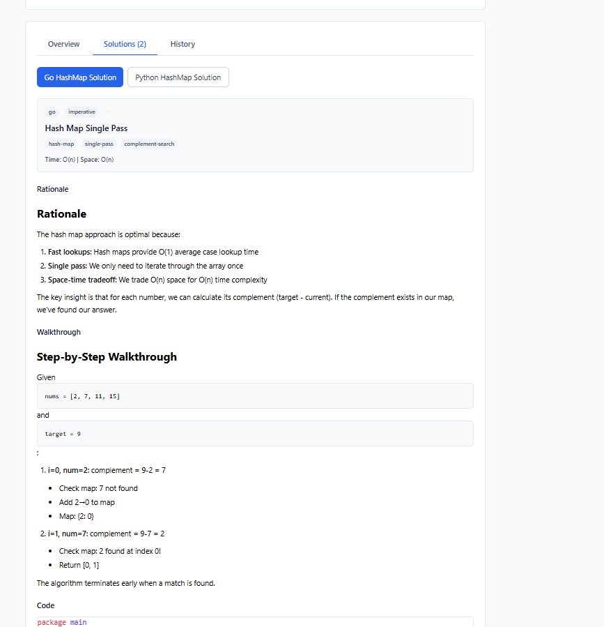
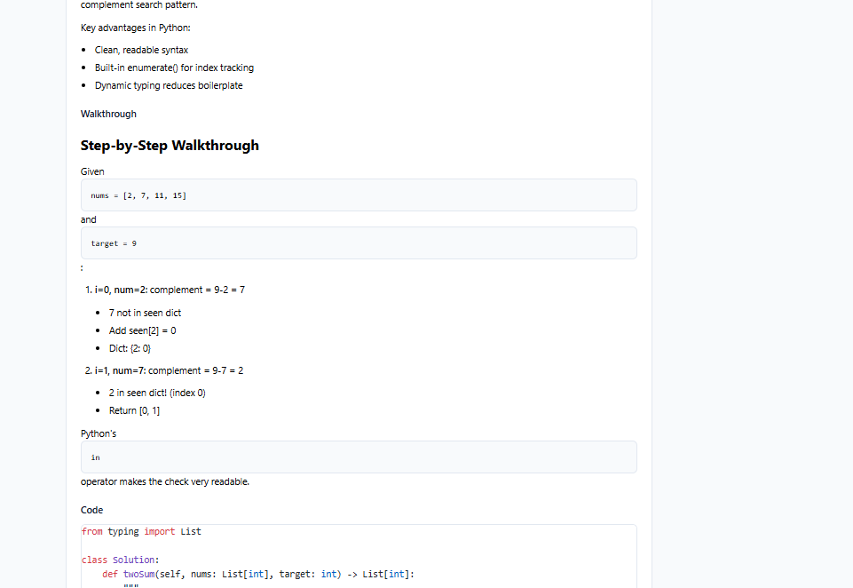
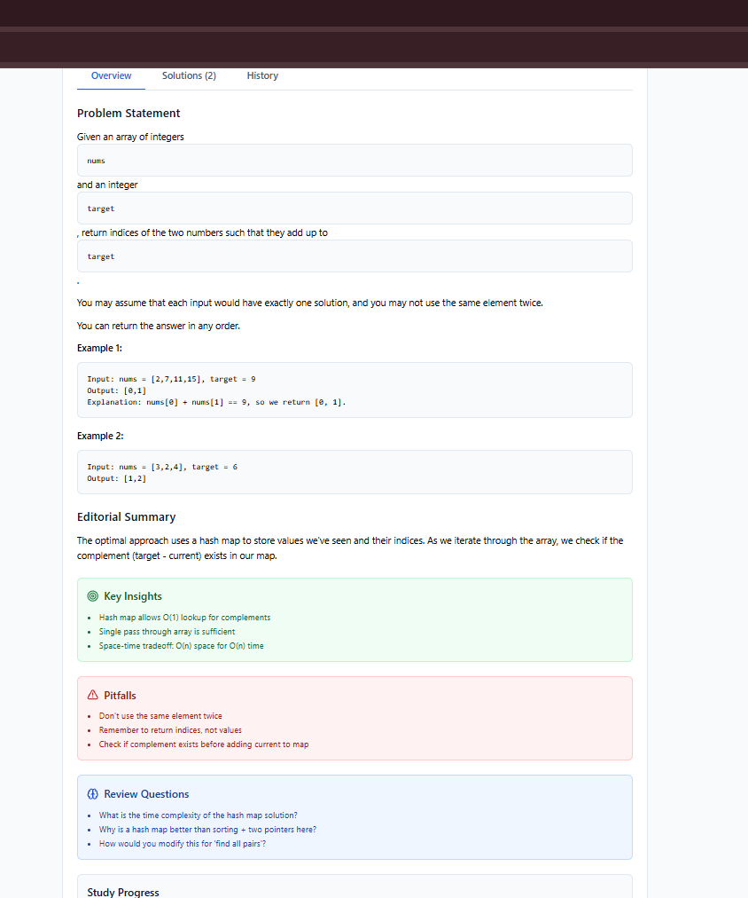

# 🚨 Problemas de UI Identificados

Este documento detalha os problemas visuais encontrados na aplicação, com foco especial no **problema crítico de formatação do markdown**.

---

## 📸 Evidências Visuais

### Screenshot 1 - Aba Solutions (Go)


### Screenshot 2 - Aba Solutions (Python)


### Screenshot 3 - Aba Overview


---

## 🔴 PROBLEMA CRÍTICO: Formatação do Markdown Inline

### Descrição
O texto markdown que deveria ser renderizado inline está sendo quebrado em blocos separados.

### Exemplo do Problema

**Conteúdo Original (YAML):**
```yaml
statement_md: |
  Given an array of integers `nums` and an integer `target`, return indices...
```

**Renderização Esperada:**
> Given an array of integers `nums` and an integer `target`, return indices...

**Renderização Atual:**
```
Given an array of integers

┌──────────────────┐
│       nums       │ ← Bloco separado incorretamente
└──────────────────┘

and an integer

┌──────────────────┐
│      target      │ ← Bloco separado incorretamente
└──────────────────┘

, return indices...
```

---

## 🔍 Diagnóstico

### Causa 1: YAML Literal Block Scalar (`|`)

O operador `|` preserva newlines literais:

```yaml
# PROBLEMA: Cada linha se torna um parágrafo separado
statement_md: |
  Given an array of integers `nums`

  and an integer `target`
```

**Impacto:** O markdown interpreta a linha vazia como separador de parágrafos.

### Causa 2: Prop `inline` Deprecated no react-markdown

```typescript
// CÓDIGO ATUAL (MarkdownRenderer.tsx)
code: ({ inline, children }) =>
  inline ? (
    <code className="bg-slate-100 ...inline...">
      {children}
    </code>
  ) : (
    <code className="block bg-slate-50 ...block...">
      {children}
    </code>
  ),
```

**Problema:** A versão `react-markdown@10.x` não passa mais a prop `inline` por padrão!

A prop `inline` agora precisa ser inferida baseando-se no elemento pai ou usando outro método.

---

## 🔧 Soluções Propostas

### Solução 1: Atualizar MarkdownRenderer.tsx

```typescript
import ReactMarkdown from 'react-markdown';
import remarkGfm from 'remark-gfm';

export function MarkdownRenderer({ content }: MarkdownRendererProps) {
  return (
    <div className="prose prose-sm max-w-none">
      <ReactMarkdown
        remarkPlugins={[remarkGfm]}
        components={{
          // Nova abordagem: verificar o node pai
          code: ({ node, className, children, ...props }) => {
            // Se o node pai é 'pre', é bloco de código
            const isBlock = node?.position?.start.line !== node?.position?.end.line
                         || className?.includes('language-');
            
            if (isBlock) {
              return (
                <code
                  className="block bg-slate-800 text-slate-100 p-4 rounded-lg 
                             text-sm font-mono overflow-x-auto"
                  {...props}
                >
                  {children}
                </code>
              );
            }
            
            // Código inline
            return (
              <code
                className="bg-slate-100 text-slate-800 px-1.5 py-0.5 
                           rounded text-sm font-mono"
                {...props}
              >
                {children}
              </code>
            );
          },
          
          pre: ({ children }) => (
            <pre className="mb-4 not-prose">{children}</pre>
          ),
          
          // Outros componentes...
        }}
      >
        {content}
      </ReactMarkdown>
    </div>
  );
}
```

### Solução 2: Corrigir Conteúdo YAML

Usar `>-` (folded block scalar) ao invés de `|`:

```yaml
# ANTES (quebra parágrafos)
statement_md: |
  Given an array of integers `nums` and an integer `target`
  
  You may assume that each input would have exactly one solution.

# DEPOIS (junta em uma linha, newlines viram espaços)
statement_md: >-
  Given an array of integers `nums` and an integer `target`.
  You may assume that each input would have exactly one solution.
```

**Quando usar cada um:**
- `|` - Preserva quebras de linha (bom para código, listas)
- `>` - Junta linhas com espaço (bom para parágrafos)
- `>-` - Junta linhas, remove trailing newline

### Solução 3 (Recomendada): Combinar Ambas

1. **Atualizar MarkdownRenderer** para detectar inline corretamente
2. **Revisar YAMLs** para usar a escalar correta por contexto

---

## 📋 Checklist de Correção

### MarkdownRenderer.tsx
- [ ] Remover dependência da prop `inline` deprecated
- [ ] Usar verificação de node pai para detectar bloco vs inline
- [ ] Adicionar suporte a syntax highlighting para blocos

### Arquivos YAML
- [ ] `problem.yaml` → Revisar `statement_md`
- [ ] `sol_go_hashmap.yaml` → Revisar `rationale_md` e `walkthrough_md`
- [ ] `sol_py_hashmap.yaml` → Revisar `rationale_md` e `walkthrough_md`

---

## 🔴 Outros Problemas de UI

### 1. Falta de Feedback Visual de Loading

**Problema:** Não há skeleton ou spinner ao carregar soluções

**Impacto:** Experiência de usuário degradada

**Solução:**
```typescript
if (loading) return <SolutionSkeleton />;
```

### 2. Código sem Syntax Highlighting Adequado

**Problema:** O `MarkdownRenderer` renderiza código sem cores
**Nota:** O `CodeViewer` usa Shiki, mas o markdown interno não

**Solução:** Integrar rehype-shiki para highlighting em markdown

---

### 3. Responsividade em Telas Pequenas

**Problema:** Alguns elementos não se adaptam bem a mobile

**Locais afetados:**
- Filtros na Library ficam apertados
- Code blocks com overflow horizontal
- Badges podem quebrar layout

---

### 4. Acessibilidade

**Problemas identificados:**
- Tabs sem suporte a keyboard (arrow keys)
- Falta de ARIA labels em alguns botões
- Contraste de cores em algumas badges

---

## 📈 Priorização

| # | Problema | Impacto | Esforço | Prioridade |
|---|----------|---------|---------|------------|
| 1 | Markdown inline vs bloco | Alto | Médio | 🔴 Crítico |
| 2 | Loading states | Médio | Baixo | 🟠 Alto |
| 3 | Syntax highlighting em MD | Médio | Médio | 🟠 Alto |
| 4 | Responsividade | Médio | Médio | 🟡 Médio |
| 5 | Acessibilidade | Baixo | Alto | 🟡 Médio |

---

> **Próximo documento**: [04_logica_data.md](./04_logica_data.md) - Análise da lógica de dados
